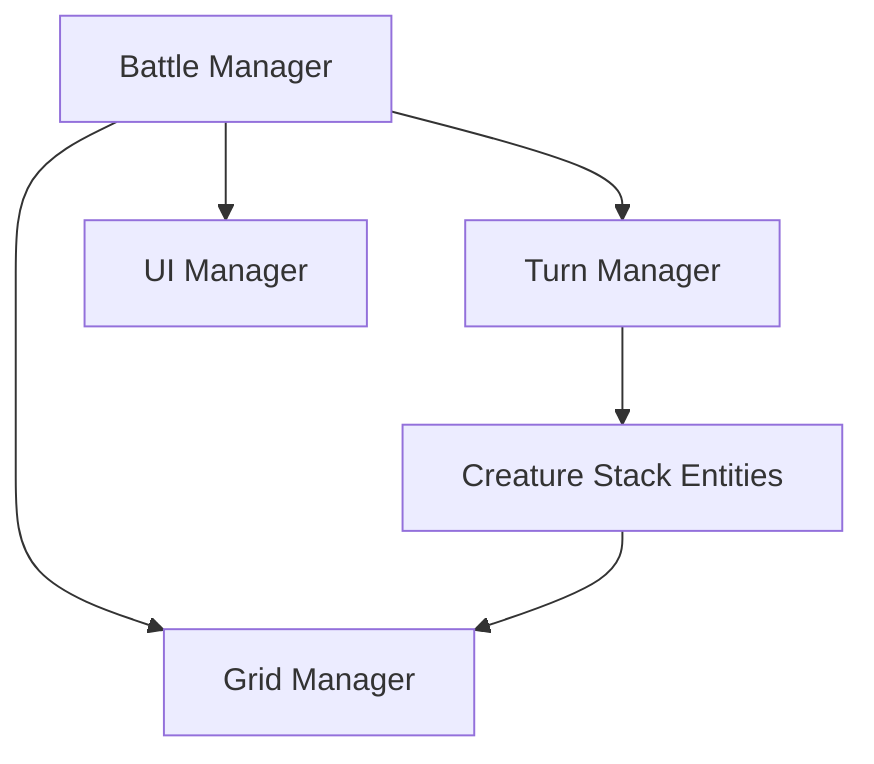

# Architecture & System Design

This document details the code structure and architectural patterns of the HoMM V combat system clone in Unity.

## 1. High-Level Architecture
*(Describe how main managers communicate, e.g., BattleManager, GridManager, TurnManager, UIManager)*

## 2. Core Managers
* **BattleManager**: Coordinates game states (Setup, Combat, Victory, Defeat).
* **GridManager**: Generates and manages the square grid, pathfinding, and obstacle positioning.
* **TurnManager**: Calculates the initiative order, manages the turn timeline, and handles wait/defend states.
* **UIManager**: Updates the initiative timeline UI, stack numbers, combat log, and menus.

## 3. Data Models
* **CreatureData (ScriptableObject)**: Base definition of a unit type (base stats, prefab model, abilities).
* **CreatureStack (MonoBehaviour/Class)**: Active instance of a stack on the battlefield (tracks current count, remaining HP, current buffs/debuffs).
* **HeroData (ScriptableObject)**: Base stats, spellbook, and progression info.

## 4. Systems
* **Pathfinding System**: Grid-based pathfinding (A* or Breadth-First Search customized for square grids and fly/ground movement).
* **Combat & Damage Calculator**: Computes damage based on formula: `f(Attack, Defense, StackSize, DamageRange, etc.)`.
* **Abilities & Effects System**: Component-based or strategy-based execution of buffs, debuffs, and special abilities.
